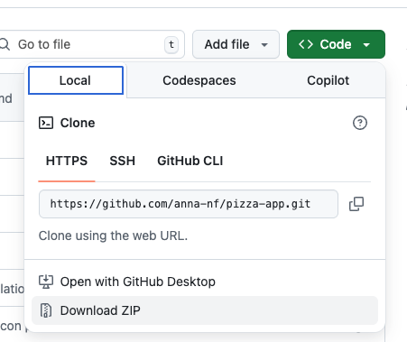
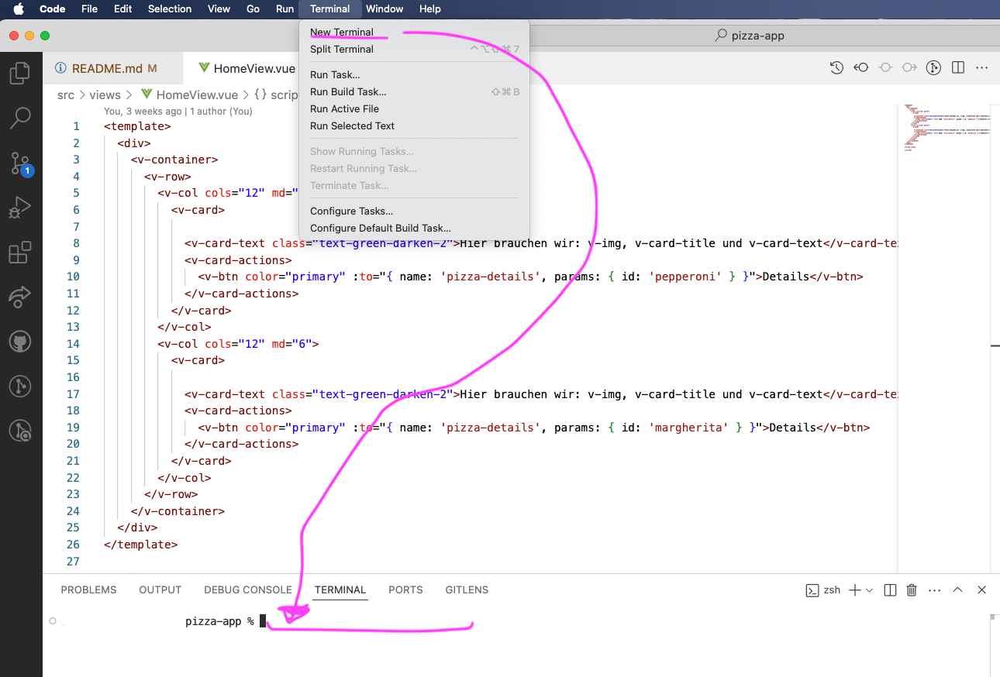
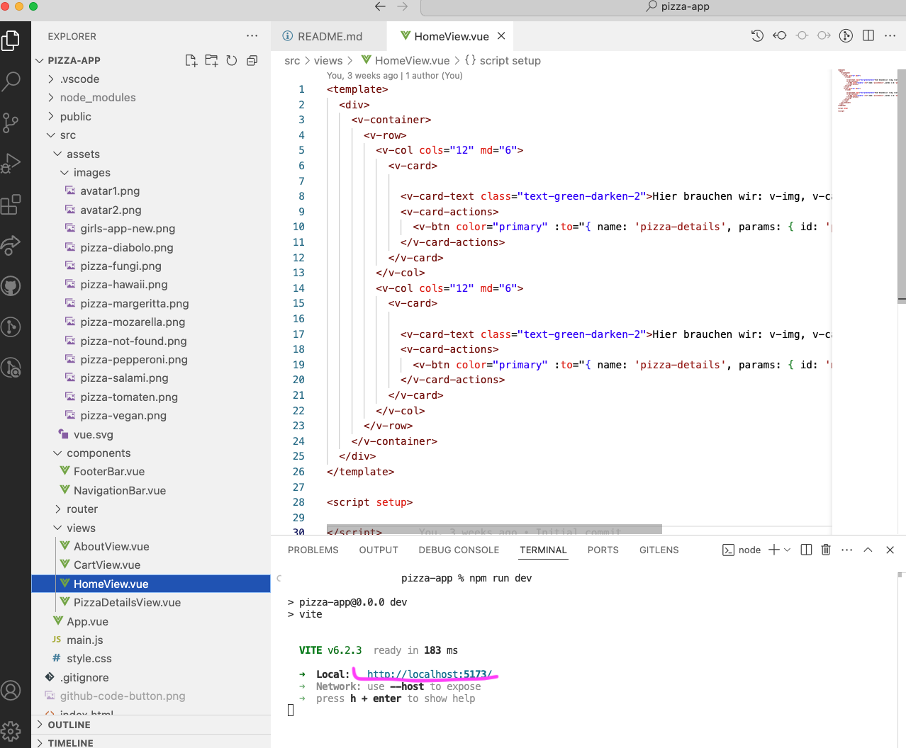

## Installations- und Startanleitung

### 🟢 Schritt 1: Code herunterladen

**Ziel:** Die Pizza-App auf dem eigenen Rechner haben

👋 Willkommen bei deinem ersten Coding-Abenteuer! Wir bauen gemeinsam eine coole App – und du kannst alles selbst ausprobieren.
Los geht's: Hol dir erstmal den Code von GitHub.

**Anleitung:**

1. Scrolle nach Oben
2. Klicke auf den grünen Button „Code"
   
3. Wähle „Download ZIP"
4. Entpacke die ZIP-Datei (rechte Maustaste → Entpacken)

🧁 **Extra-Erklärung:**
„Der Code ist wie ein Rezept – wir laden ihn herunter, damit du ihn anschauen und anpassen kannst."

### 🔵 Schritt 2: VS Code installieren

**Ziel:** Den richtigen Editor zum Programmieren haben

Damit du mit dem Code arbeiten kannst, brauchst du ein Programm – wie ein digitales Schulheft für Programmieren. Es heißt Visual Studio Code.

**Anleitung:**

1. Gehe auf https://code.visualstudio.com/
2. Klicke auf Download
3. Öffne und installiere das Programm

💡 **Hinweis:** VS Code ist kostenlos und legal - es ist ein offizielles Open-Source-Tool von Microsoft und wird von fast allen Frontend-Entwicklern weltweit genutzt.

🧁 **Extra-Tipp:**
Du kannst auch dein Lieblings-Theme einstellen – bunt, dunkel oder hell 😎

### 🟠 Schritt 3: Node.js installieren

**Ziel:** Damit deine App funktioniert, brauchst du einen Helfer auf dem Rechner: Node.js

Node.js ist wie der Motor, der deine App startet – und npm ist das Werkzeug dazu.

**Anleitung:**

1. Gehe auf https://nodejs.org
2. Klicke auf den großen grünen Button:
   👉 LTS-Version herunterladen (empfohlen)
   (steht für "Long Term Support")
3. Öffne die heruntergeladene Datei und folge den Installations-Schritten

Wenn da eine Versionsnummer erscheint (z. B. v18.17.1), dann ist alles bereit! 🚀

### 🟡 Schritt 4: Projekt öffnen in VS Code

**Ziel:** Das heruntergeladene Projekt starten

**Anleitung:**

1. Öffne VS Code
2. Klicke auf Datei → Ordner öffnen
3. Wähle den entpackten Pizza-App-Ordner aus

### 🟣 Schritt 5: Terminal & npm

**Ziel:** App starten und npm verstehen

npm ist wie ein Lieferdienst für Extras, die dein Projekt braucht – z. B. Werkzeuge und Bausteine.

**Anleitung:**

1. Öffne das Terminal in VS Code (oben: „Terminal → Neues Terminal")
   
2. Gib ein: `npm install` → drücke Enter (📦 Damit werden alle Bausteine installiert)
3. Dann: `npm run dev` → drücke Enter
4. Im Terminal erscheint ein Link (beginnt mit http://localhost) - klicke darauf, um deine App im Browser zu öffnen!
   
5. Jetzt öffnet sich deine App im Browser! 🚀

## 🎨 Deine eigene Pizza-App gestalten

**Super!** Deine App läuft jetzt auf deinem Computer - nur für dich sichtbar. Das nennt man "lokal" entwickeln.

### Was kannst du jetzt machen?

#### 📸 Eigene Bilder hinzufügen

1. Im Ordner `images` findest du alle Bilder der App
2. Du kannst hier eigene Fotos hinzufügen:
   - Füge einfach deine Bilder in diesen Ordner (einfach per Drag & Drop)
   - In VS Code siehst du dann deine neuen Bilder erscheinen!

#### 👩‍💻 Die App verändern

Unsere App besteht aus zwei Hauptteilen:

1. **Components** (Bausteine):

   - Dies sind wie Lego-Steine, aus denen deine App gebaut ist
   - Zum Beispiel: FooterBar, NavigationBar

2. **Views** (Seiten):
   - Das sind die verschiedenen Bildschirme in deiner App
   - Zum Beispiel: AboutView, HomeView

## 🔧 So kannst du den Code bearbeiten

Beim Girls Day 2025 haben wir zusammen gelernt, wie man Code verändert. Hier ist ein Beispiel:

### 🏠 HomeView anpassen

1. **Öffne die Datei:**

   - Schau auf die linke Seite in VS Code - dort findest du das Explorer-Menü
   - Falls du es nicht siehst, klicke auf das Dateisymbol ganz oben links
   - Suche nach dem Ordner `src` und klicke auf den kleinen Pfeil davor, um ihn zu öffnen
   - Wenn Ordner wie `components`, `views` oder `assets` zugeklappt sind, klicke auf den Pfeil daneben, um sie aufzuklappen
   - Öffne den Ordner `views` und suche die Datei `HomeView.vue`
   - Klicke sie doppelt an, um sie zu öffnen

2. **Die Pizza-Karten verbessern:**

   - Suche im Code nach der Zeile: `Hier brauchen wir: v-img, v-card-title und v-card-text`
   - Ersetze diese Zeile mit:

   ```html
   <v-img
     src="src/assets/images/pizza-pepperoni.png"
     height="200"
     cover
   ></v-img>
   <v-card-title>Pizza Pepperoni</v-card-title>
   <v-card-text>Leckere Pizza mit Tomatensoße, Käse und Pepperoni</v-card-text>
   ```

   - Mache das Gleiche für die zweite Karte (mit einem anderen Bild und Text)

3. **Änderungen speichern:**
   - Auf Mac: Halte `CMD` gedrückt und drücke `S`
   - Auf Windows: Halte `STRG` gedrückt und drücke `S`
   - Deine Änderungen werden sofort im Browser angezeigt! ✨

### 🎨 Über die verwendete Technologie

Diese Pizza-App nutzt **Vuetify** - eine Bibliothek von fertigen Bauteilen für hübsche Apps. Alle Komponenten, die mit `v-` beginnen (wie `v-card`, `v-btn`) kommen aus Vuetify.

Vuetify ist - wie alles in diesem Projekt - Open Source. Das bedeutet, dass der Code öffentlich ist und von jedem kostenlos genutzt werden kann. So lernen Programmierer:innen voneinander und können gemeinsam bessere Software bauen!

## 💬 Glossar

| Begriff     | Erklärung                                                         | Website                                   |
| ----------- | ----------------------------------------------------------------- | ----------------------------------------- |
| GitHub      | Website, auf der man Code teilt                                   | https://github.com                        |
| VS Code     | Ein Programm, in dem man Code schreibt                            | https://code.visualstudio.com             |
| npm         | Ein Tool, das Dinge für deine App herunterlädt                    | https://www.npmjs.com                     |
| Terminal    | Fenster, in das du Befehle eintippst                              | -                                         |
| Vue         | JavaScript-Framework zum Erstellen von modernen Websites und Apps | https://vuejs.org                         |
| Vuetify     | Sammlung fertiger Bauteile für schöne Apps (z.B. Buttons, Karten) | https://vuetifyjs.com                     |
| Open Source | Software, deren Quellcode öffentlich und kostenlos nutzbar ist    | https://de.wikipedia.org/wiki/Open_Source |
